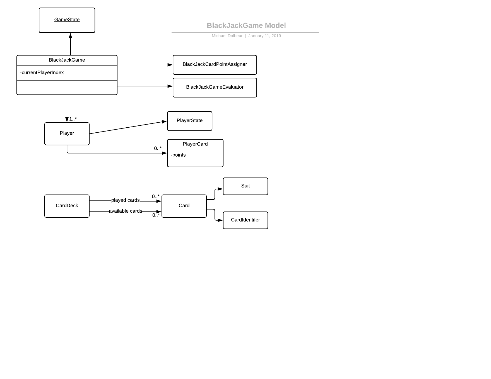

#Blackjack node.js
This project is very similar to its java version in logic, but its implemented in node.js. My goal with this is to
try out the MEAN architecture but I currently only have ME. I still need to implement the UI in Angular. I am
very new to node.js and express, so I have probably committed mortal sins. 



1) Make sure you install node. I am using 10.x here.

2) Install docker in your environment. I am using docker for mac.

3) To get Mongo, do the following:

```docker run -p 27017:27017 mongo```

4) In the main directory, do

```npm install```

to pick up the dependencies outlined in package.json.

5) to start the app via command line do:

```npm start```

6) Here are a set of commands you can run to execute the game (bring up a shell to run these):


```curl -X POST http://localhost:3000/blackjack/createCardDeck```

The reply back will be the card deck uuid: 854cdb50-2006-11e9-a8a0-8b231ff05045

```curl -X POST  http://localhost:3000/blackjack/startGame/1```

This creates a game with 1 player. It will respond with the uuid of the game:
c224ead0-2007-11e9-a8a0-8b231ff05045

To get the state of the game, do the following:

curl http://localhost:3000/blackjack/gameState/c224ead0-2007-11e9-a8a0-8b231ff05045


You can play hands until the game terminates, by running the following curl command:

curl -X POST http://localhost:3000/blackjack/playHand/854cdb50-2006-11e9-a8a0-8b231ff05045/c224ead0-2007-11e9-a8a0-8b231ff05045

To get the state of the terminated game, run the command to get game state again. Here is an
example state for a terminated game:

curl http://localhost:3000/blackjack/gameState/c224ead0-2007-11e9-a8a0-8b231ff05045

{"statusCode":200,
 "result":{
    "gameId":"c224ead0-2007-11e9-a8a0-8b231ff05045",
    "players":[
    {"playerId":"c22511e1-2007-11e9-a8a0-8b231ff05045","playerState":"lost","points":29}
    ]
  }
 }
    

